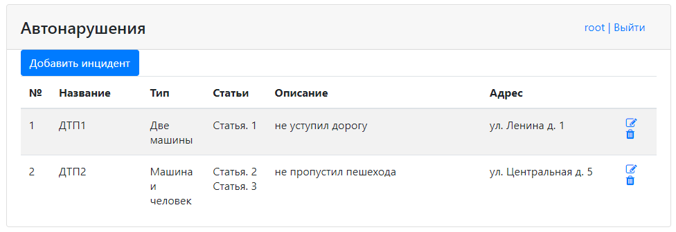

# Проект - Car accident

## О проекте

* Данное веб-приложение представляет собой систему учёта автопроисшествий:
   
* При добавлении нового инцидента нужно указать его название, тип, статью (одну или несколько), описание, адрес:
   
* Возможно также редактировать уже существующие инциденты.
* Неавторизованные пользователи с приложением работать не могут.
* Регистрация основана на контроллере RegControl, который инициирует сохранение новых пользователей в БД.
  Форма регистрации:
   
* Авторизация построена на Spring Security. Все зарегистрированные пользователи хранятся в БД, пароли - в закодированном виде. 
Форма авторизации:
   
* По умолчанию в БД есть пользователь с ролью администратора. Его логин - *root*, пароль - *secret*.
* Все формы приложения провалидированы с помощью JS и JQuery:
   
   
* Конфигурация всех технологий проекта произведена с помощью Java-классов вместо xml-конфигурации.
* Проект построен на трёх слоях: слой по работе с БД, слой контроллеров и слой сервисов.
* Для работы с БД по умолчанию используется Spring Data JPA. Есть также возможность заменить данную реализацию
  на Spring JDBC, Spring HibernateTemplate или же хранить все данные в памяти.
* Слой контроллеров использует Spring MVC.
* Слой сервисов содержит логику приложения.
* В качестве БД используется PostgreSQL.
* Проект построен по шаблону MVC. Все виды открываются через GET-методы контроллеров,
  что позволяет передавать на виды необходимые данные.
* Для логирования используется связка slf4j и log4j.
* В качестве видов используются JSP-страницы, реализованные с помощью HTML и Bootstrap.
* Для реализации логики отображения на видах используется JSTL.

## Сборка

Для сборки проекта необходимо:
1. Установить JDK 14.
2. Установить Maven.
3. Установить сервер БД PostgreSQL, задать логин - *postgres*, пароль - *password*.
4. Установить Tomcat.
5. Скачать исходный код проекта.
6. Перейти в корень проекта, где лежит файл `pom.xml`.
7. Собрать проект командой `mvn -DskipTests=true package`.
   При успешной сборке должна появиться папка target c `car_accident-2.war`.
8. Переименовать war-архив в `accident.war`.
9. Создать в pg_Admin БД *auto_crash*.
10. Открыть Query Tool для созданной БД и запустить SQL-скрипт `schema.sql` и `security.schema.reg.sql`,
    находящийся в папке `db`.
11. Скопировать `accident.war` в папку `webapps` Tomcat.
12. Запустить сервер с помощью `startup.bat` из папки `bin` Tomcat.

## Использование

Перейдем на главную [страницу](http://localhost:8080/accident/) приложения.

Зарегистрируемся и авторизуемся:

Добавим происшествие:

Проверим результат:

Отредактируем инцидент:

Все получилось:

Зайдем под *root* пользователем:

И добавим инцидент:

Проверим результат:

## Контакты

